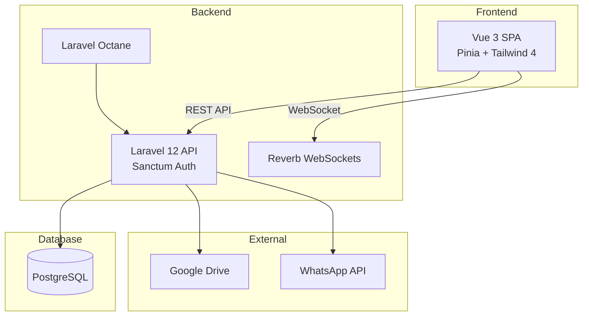
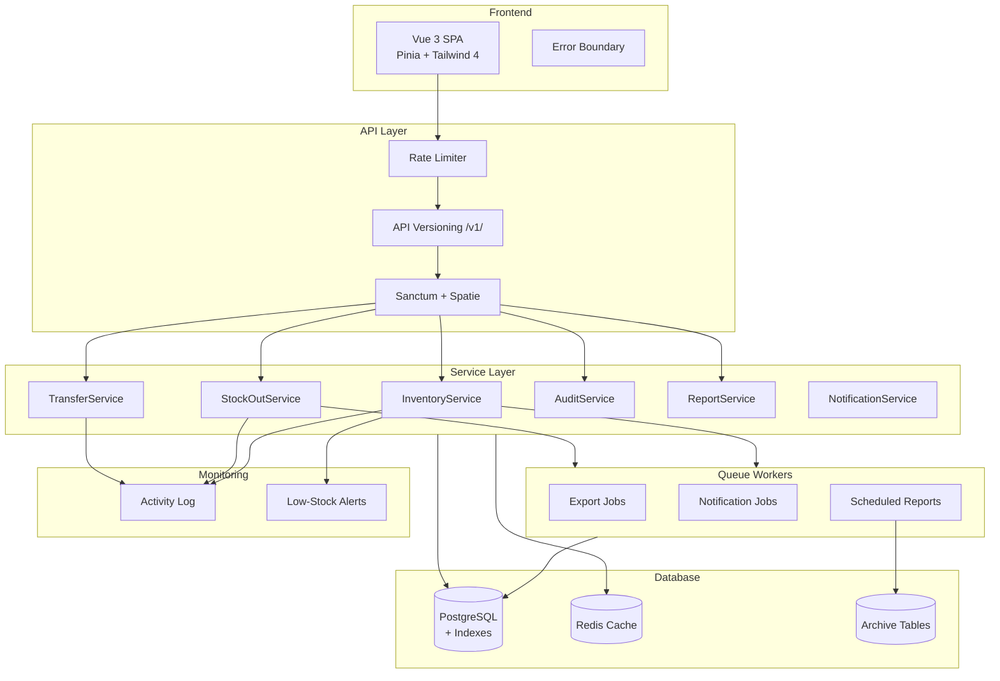
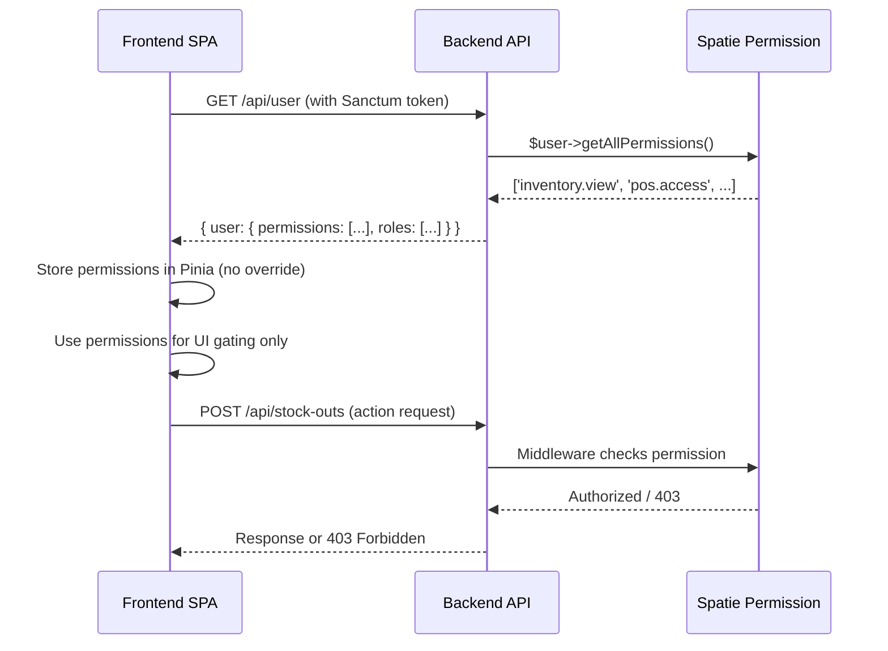
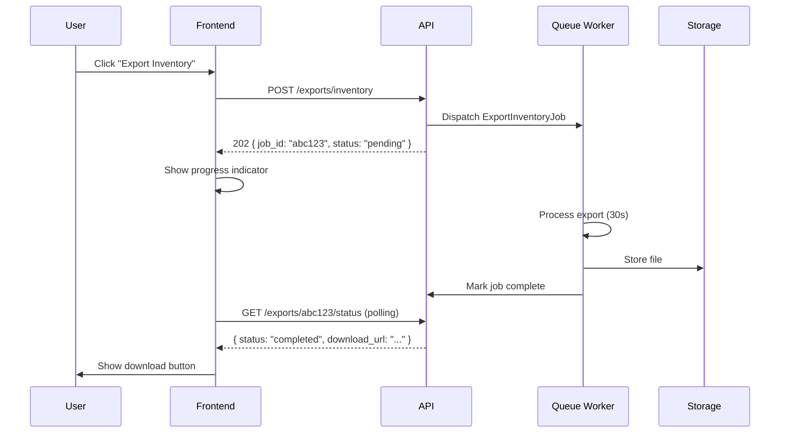
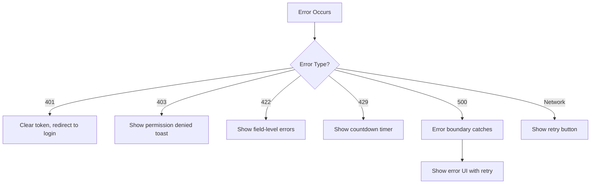
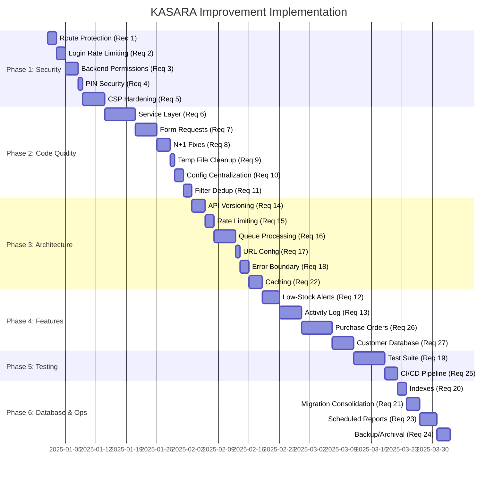

# Design Document: KASARA Comprehensive Improvement

## Overview

This design document defines the technical architecture for a phased improvement of the KASARA retail inventory management system. KASARA is a production Laravel 12 + Vue 3 application managing IMEI-tracked phones and non-IMEI accessories across multiple branches, warehouses, online shops, and distributors with 12+ user roles.

All changes follow three inviolable constraints: (1) no data loss — the database has 5 months of production data, (2) all migrations are additive — no dropping columns or tables, (3) existing API contracts remain backward-compatible, and (4) the system remains operational during incremental deployment.

The improvements are organized into six implementation phases ordered by criticality: Security → Code Quality → Architecture → Features → Testing/CI → Operations.

## Architecture

### Current System Architecture



### Target Architecture (Post-Improvement)



---

## Phase 1: Security Hardening (Requirements 1–5)

### Component: Route Protection (Req 1)

**Purpose**: Move unprotected fix/debug routes behind authentication middleware.

**Current Problem**: Routes `/inventory/fix-data`, `/inventory/fix-logs`, and `/debug-pending` are outside the `auth:sanctum` middleware group.

**Solution**:

```php
// routes/api.php — REMOVE these lines:
// Route::get('/inventory/fix-data', [InventoryController::class, 'fixMergedImeis']);
// Route::get('/inventory/fix-logs', [InventoryController::class, 'fixInventoryLogs']);

// MOVE inside auth:sanctum group with role restriction:
Route::middleware(['auth:sanctum'])->group(function () {
    // Admin-only maintenance routes
    Route::middleware(['role:super_admin'])->prefix('admin')->group(function () {
        Route::get('/fix-data', [InventoryController::class, 'fixMergedImeis']);
        Route::get('/fix-logs', [InventoryController::class, 'fixInventoryLogs']);
    });
    
    // Remove debug-pending entirely or gate it
    // Route::get('/debug-pending', ...) — REMOVE
});
```

**Migration Strategy**: Deploy route changes first, verify no external systems depend on public access.

### Component: Login Rate Limiting (Req 2)

**Purpose**: Prevent brute-force attacks on the login endpoint.

**Current State**: Login route has `throttle:1000,1` — effectively no protection.

**Solution**:

```php
// app/Providers/AppServiceProvider.php (or RouteServiceProvider)
use Illuminate\Cache\RateLimiting\Limit;
use Illuminate\Support\Facades\RateLimiter;

public function boot(): void
{
    RateLimiter::for('login', function (Request $request) {
        return Limit::perMinute(5)->by($request->ip())->response(function ($request, $headers) {
            return response()->json([
                'message' => 'Too many login attempts. Please try again later.',
                'retry_after' => $headers['Retry-After'] ?? 60,
            ], 429)->withHeaders($headers);
        });
    });
}

// routes/api.php
Route::post('/login', [AuthController::class, 'login'])->middleware('throttle:login');
```

**Backward Compatibility**: Legitimate users with correct credentials are unaffected. Only rapid-fire attempts are blocked.

### Component: Backend-Authoritative Permissions (Req 3)

**Purpose**: Make the backend the single source of truth for permissions, eliminating frontend overrides.

**Current Problem**: The `enrichUserPermissions()` function in `auth.js` replaces backend permissions with local `ROLE_PERMISSIONS` config:
```javascript
// CURRENT (INSECURE): Frontend overrides backend permissions
permissions = localPermissions; // This line must be removed
```

**Solution — Backend**:

```php
// app/Http/Controllers/AuthController.php — me() method
public function me(Request $request)
{
    $user = $request->user();
    $user->load(['roles', 'branch', 'warehouse', 'onlineShop', 'distributor']);
    
    return response()->json([
        'user' => [
            ...$user->toArray(),
            'permissions' => $user->getAllPermissions()->pluck('name')->toArray(),
            'roles' => $user->roles->map(fn($r) => ['name' => $r->name]),
        ]
    ]);
}
```

**Solution — Frontend**:

```javascript
// store/auth.js — Replace enrichUserPermissions
const enrichUserPermissions = (userData) => {
    if (!userData) return null;
    // Use backend permissions directly — no local override
    return {
        ...userData,
        permissions: userData.permissions || []
    };
};
```

**Fallback**: Local permission definitions remain in `utils/permissions.js` for UI display hints only (sidebar menu visibility when offline). All API calls are enforced server-side regardless.

### Sequence: Permission Flow



### Component: PIN Security (Req 4)

**Purpose**: Ensure transaction PINs are never exposed in API responses.

**Current State**: `transaction_pin` is already in the User model's `$hidden` array and the `transaction_pin_exists` accessor exists. However, the PIN field is in `$fillable` which allows mass assignment.

**Solution**:

```php
// app/Models/User.php — Verify these are in place:
protected $hidden = [
    'password',
    'remember_token',
    'transaction_pin', // Already present ✓
];

protected $appends = [
    'transaction_pin_exists', // Already present ✓
];

// Add API Resource to guarantee field exclusion:
// app/Http/Resources/UserResource.php (new)
class UserResource extends JsonResource
{
    public function toArray($request): array
    {
        return [
            'id' => $this->id,
            'name' => $this->name,
            'full_name' => $this->full_name,
            'username' => $this->username,
            // ... all fields EXCEPT transaction_pin
            'transaction_pin_exists' => $this->transaction_pin_exists,
            'pin_enabled' => $this->pin_enabled,
        ];
    }
}
```

**Frontend**: PIN input components must clear the PIN value from reactive state after verification response is received.

### Component: Content Security Policy (Req 5)

**Purpose**: Remove `unsafe-inline` and `unsafe-eval` from CSP to mitigate XSS.

**Current State**: CSP in `SecurityHeaders.php` includes both `'unsafe-inline'` and `'unsafe-eval'` in `script-src`.

**Solution — Nonce-Based CSP**:

```php
// app/Http/Middleware/SecurityHeaders.php
public function handle(Request $request, Closure $next): Response
{
    $nonce = base64_encode(random_bytes(16));
    $request->attributes->set('csp_nonce', $nonce);
    
    $response = $next($request);
    
    $csp = implode('; ', [
        "default-src 'self'",
        "script-src 'self' 'nonce-{$nonce}'",
        "style-src 'self' 'nonce-{$nonce}' https://fonts.googleapis.com",
        "font-src 'self' https://fonts.gstatic.com data:",
        "img-src 'self' data: blob: https://ui-avatars.com " . config('app.url'),
        "connect-src 'self' " . config('app.url') . " wss://" . parse_url(config('app.url'), PHP_URL_HOST),
        "object-src 'none'",
        "frame-ancestors 'self'",
        "base-uri 'self'",
        "form-action 'self'",
        "upgrade-insecure-requests",
    ]);
    
    $response->headers->set('Content-Security-Policy', $csp);
    return $response;
}
```

**Frontend Vite Config**: Configure Vite to inject nonce attributes on script/style tags. For Chart.js which may use `new Function()`, use a strict-dynamic fallback or pre-compile chart configurations.

**Phased Rollout**: Deploy with `Content-Security-Policy-Report-Only` first, monitor violations, then enforce.

---

## Phase 2: Code Quality (Requirements 6–11)

### Component: Service Layer Architecture (Req 6)

**Purpose**: Extract business logic from controllers into dedicated service classes.

**Current Problem**: `InventoryController.php` is 1500+ lines with business logic, queries, and response formatting mixed together.

**Target Structure**:

```
app/
├── Http/
│   └── Controllers/
│       ├── Inventory/
│       │   ├── InventoryController.php      (index, show, update — <200 lines)
│       │   ├── StockInController.php        (stockIn, voidStockIn — <200 lines)
│       │   ├── InventoryAccountController.php (account CRUD — <200 lines)
│       │   └── InventoryExportController.php  (export methods — <200 lines)
│       └── ...
├── Services/
│   ├── Inventory/
│   │   ├── InventoryService.php
│   │   ├── InventoryFilterService.php
│   │   ├── StockInService.php
│   │   └── InventoryExportService.php
│   ├── StockOut/
│   │   └── StockOutService.php
│   ├── Transfer/
│   │   └── TransferService.php
│   ├── Audit/
│   │   └── AuditService.php
│   └── Report/
│       └── ReportService.php
└── ...
```

**Interface Design**:

```php
<?php
namespace App\Services\Inventory;

use App\Models\User;
use Illuminate\Http\Request;
use Illuminate\Pagination\LengthAwarePaginator;

interface InventoryServiceInterface
{
    public function getFilteredInventory(User $user, array $filters, string $type): LengthAwarePaginator;
    public function calculateTotalValue(array $filters, string $type): float;
    public function getFilterOptions(User $user): array;
    public function getMetaLocations(User $user): array;
}

interface StockInServiceInterface
{
    public function processStockIn(User $user, array $data): array;
    public function voidStockIn(User $user, int $logId): bool;
}
```

**Migration Strategy**: 
1. Create service classes that wrap existing controller logic
2. Update controllers to delegate to services
3. Verify all API responses remain identical
4. No route changes needed — same URLs, same responses

### Component: Form Request Validation (Req 7)

**Purpose**: Move inline validation into dedicated Form Request classes.

**Example — StockIn**:

```php
<?php
namespace App\Http\Requests\Inventory;

use Illuminate\Foundation\Http\FormRequest;

class StockInRequest extends FormRequest
{
    public function authorize(): bool
    {
        return $this->user()->can('inventory.stock_in');
    }

    public function rules(): array
    {
        $rules = [
            'product_id' => 'required|exists:products,id',
            'placement_type' => 'required|in:branch,warehouse,online_shop,distributor',
            'placement_id' => 'required|integer',
            'user_id' => 'nullable|exists:users,id',
            'distributor_id' => 'nullable|exists:distributors,id',
            'supplier_name' => 'nullable|string|max:255',
            'cost_price' => 'nullable|numeric|min:0',
            'selling_price' => 'nullable|numeric|min:0',
            'notes' => 'nullable|string|max:1000',
        ];

        // IMEI items require additional fields
        if ($this->input('type') === 'hp') {
            $rules['imei'] = 'required|string|max:20|unique:product_details,imei';
            $rules['condition'] = 'required|in:new,second,ex_ibox';
            $rules['ram'] = 'nullable|string|max:10';
            $rules['storage'] = 'nullable|string|max:10';
        } else {
            $rules['quantity'] = 'required|integer|min:1';
        }

        return $rules;
    }

    public function messages(): array
    {
        return [
            'imei.unique' => 'IMEI sudah terdaftar di sistem.',
            'product_id.exists' => 'Produk tidak ditemukan.',
            'quantity.min' => 'Jumlah minimal 1.',
        ];
    }
}
```

**Form Requests to Create**:
| Request Class | Endpoint | Key Validations |
|---|---|---|
| `StockInRequest` | POST /inventory/stock-in | product, placement, IMEI/qty |
| `StockOutRequest` | POST /stock-outs | items, customer, payment |
| `TransferRequest` | POST /transfers | source, destination, items |
| `UserStoreRequest` | POST /users | name, role, branch |
| `ProductStoreRequest` | POST /products | name, brand, type, price |
| `InventoryUpdateRequest` | PUT /inventory/{id} | status, selling_price |

### Component: N+1 Query Resolution (Req 8)

**Purpose**: Eliminate N+1 queries in inventory listing.

**Current Problem** (identified in InventoryController):
```php
// INSIDE transform() callback — executes per item:
$distName = \App\Models\Distributor::find($item->distributor_id)?->name;  // N+1!
$lastInLog = \App\Models\InventoryLog::where(...)->latest()->first();     // N+1!
```

**Solution**:

```php
<?php
namespace App\Services\Inventory;

class InventoryFilterService
{
    public function getFilteredNonHpInventory(User $user, array $filters): LengthAwarePaginator
    {
        $query = Inventory::with([
            'product',
            'user.distributor',
            'distributor',        // Direct relationship
            'latestLog.distributor',
            'placement',
        ])
        ->select(/* ... */)
        ->where('quantity', '>', 0);

        // Apply filters...
        $items = $query->paginate($filters['per_page'] ?? 20);

        // Batch-load distributor names for items missing direct relationship
        $missingDistIds = $items->getCollection()
            ->filter(fn($item) => $item->distributor_id && !$item->relationLoaded('distributor'))
            ->pluck('distributor_id')
            ->unique();
        
        $distributors = Distributor::whereIn('id', $missingDistIds)->pluck('name', 'id');

        // Batch-load latest 'in' logs for items needing supplier info
        $itemKeys = $items->getCollection()
            ->filter(fn($item) => !$item->distributor_id)
            ->map(fn($item) => "{$item->product_id}_{$item->placement_type}_{$item->placement_id}");
        
        // Single query for all needed logs
        $latestLogs = InventoryLog::whereIn(
            DB::raw("CONCAT(product_id, '_', COALESCE(branch_id::text, ''), '_', COALESCE(warehouse_id::text, ''))"),
            $itemKeys
        )->where('type', 'in')->latest()->get()->keyBy(/* composite key */);

        // Transform with pre-loaded data (no additional queries)
        $items->getCollection()->transform(function ($item) use ($distributors, $latestLogs) {
            // Use pre-loaded data instead of per-item queries
            $item->latest_distributor = $distributors[$item->distributor_id] ?? 
                ($item->latestLog?->distributor?->name ?? '-');
            return $item;
        });

        return $items;
    }
}
```

**Performance Target**: ≤5 queries for any paginated inventory request regardless of result count.

### Component: Debug/Temp File Cleanup (Req 9)

**Purpose**: Remove debug, temporary, and simulation files from the repository.

**Files to Remove**:
- `backend/app/Http/Controllers/AuditController_TEMP.php`
- Any files matching: `debug_*.php`, `tmp_check_*.php`, `fix_*.php`, `simulate_*.php`

**Gitignore Addition**:
```gitignore
# Prevent debug/temp files from being committed
debug_*
tmp_*
fix_*
simulate_*
*_TEMP.*
```

**Pre-removal Check**: Verify no production code imports or references these files.

### Component: Centralized Excluded Keywords (Req 10)

**Purpose**: Define the excluded keywords list in one place.

**Current Problem**: The list `['trial', 'anu', 'testing', 'huft', 'test']` is hardcoded in multiple locations across `User.php` model methods.

**Solution**:

```php
<?php
// config/kasara.php
return [
    'excluded_keywords' => env('KASARA_EXCLUDED_KEYWORDS', 'trial,anu,testing,huft,test'),
    
    // Parsed as array
    'excluded_keywords_array' => explode(',', env('KASARA_EXCLUDED_KEYWORDS', 'trial,anu,testing,huft,test')),
];

// app/Scopes/ExcludeTestDataScope.php (reusable query scope)
<?php
namespace App\Scopes;

use Illuminate\Database\Eloquent\Builder;

trait ExcludesTestData
{
    public function scopeExcludeTestData(Builder $query, string $column = 'name'): Builder
    {
        $keywords = config('kasara.excluded_keywords_array');
        return $query->where(function ($q) use ($keywords, $column) {
            foreach ($keywords as $term) {
                $q->where($column, 'not ilike', "%{$term}%");
            }
        });
    }
}
```

**Usage in User.php**:
```php
// Before (repeated 4 times):
$excluded = ['trial', 'huft', 'anu', 'test', 'testing'];

// After (single reference):
return Branch::excludeTestData()->pluck('id')->toArray();
```

### Component: Filter Logic Deduplication (Req 11)

**Purpose**: Unify the duplicated inventory filtering logic.

**Current Problem**: `index()` and `applyInventoryFilters()` in InventoryController contain overlapping filter logic.

**Solution**:

```php
<?php
namespace App\Services\Inventory;

class InventoryFilterService
{
    public function apply(Builder $query, array $filters, string $type, User $user): Builder
    {
        // Security: placement access
        $this->applyPlacementSecurity($query, $user);
        
        // Analist exclusion
        if ($user->hasRole('analist') && !$user->hasRole('super_admin')) {
            $this->applyTestDataExclusion($query);
        }

        // Standard filters
        if (!empty($filters['placement_type'])) {
            $query->where('placement_type', $filters['placement_type']);
        }
        if (!empty($filters['placement_id'])) {
            $query->where('placement_id', $filters['placement_id']);
        }
        if (!empty($filters['brand'])) {
            $brands = is_array($filters['brand']) ? $filters['brand'] : explode(',', $filters['brand']);
            $query->whereHas('product', fn($q) => $q->whereIn('brand', $brands));
        }
        if (!empty($filters['search'])) {
            $this->applySearch($query, $filters['search'], $type);
        }
        if ($type === 'hp') {
            $this->applyHpFilters($query, $filters);
        }

        return $query;
    }
}
```

Both `index()` and `export()` will call `InventoryFilterService::apply()` ensuring consistent behavior.

---

## Phase 3: Architecture Improvements (Requirements 14–18, 22)

### Component: API Versioning (Req 14)

**Purpose**: Version the API to allow future breaking changes without disrupting existing clients.

**Solution**:

```php
// routes/api.php
Route::prefix('v1')->group(function () {
    // All existing routes moved here
    Route::post('/login', [AuthController::class, 'login'])->middleware('throttle:login');
    Route::middleware('auth:sanctum')->group(function () {
        // ... all current routes
    });
});

// Backward-compatible alias — existing /api/* still works
Route::any('{any}', function (Request $request) {
    // Internally forward to /v1/ prefix
    return app()->handle(
        Request::create('/api/v1/' . $request->path(), $request->method(), $request->all())
    );
})->where('any', '^(?!v\d+).*');
```

**Response Header**:
```php
// app/Http/Middleware/ApiVersion.php
class ApiVersion
{
    public function handle(Request $request, Closure $next): Response
    {
        $response = $next($request);
        $response->headers->set('API-Version', 'v1');
        return $response;
    }
}
```

**Frontend Update**:
```javascript
// frontend/.env
VITE_API_URL=https://api.stokps.com/api/v1

// frontend/src/api/axios.js
const baseURL = import.meta.env.VITE_API_URL || '/api/v1';
```

### Component: Rate Limiting on Sensitive Endpoints (Req 15)

**Purpose**: Prevent abuse of financial and stock-modifying endpoints.

```php
// app/Providers/AppServiceProvider.php
RateLimiter::for('stock-operations', function (Request $request) {
    $user = $request->user();
    if ($user?->hasRole('super_admin')) {
        return Limit::none();
    }
    return Limit::perMinute(30)->by($user?->id ?: $request->ip());
});

RateLimiter::for('exports', function (Request $request) {
    return Limit::perMinute(60)->by($request->user()?->id ?: $request->ip());
});

// routes/api.php — Apply to sensitive routes
Route::middleware(['throttle:stock-operations'])->group(function () {
    Route::post('/inventory/stock-in', [StockInController::class, 'store']);
    Route::post('/stock-outs', [StockOutController::class, 'store']);
    Route::post('/transfers/{id}/confirm', [TransferController::class, 'confirm']);
});

Route::middleware(['throttle:exports'])->group(function () {
    Route::get('/inventory/export', [InventoryExportController::class, 'export']);
    Route::get('/reports/export-sales', [ReportController::class, 'exportSales']);
});
```

### Component: Queue-Based Processing (Req 16)

**Purpose**: Move heavy export/report operations to background jobs.



**Job Implementation**:

```php
<?php
namespace App\Jobs;

use App\Models\ExportLog;
use Illuminate\Bus\Queueable;
use Illuminate\Contracts\Queue\ShouldQueue;
use Illuminate\Queue\InteractsWithQueue;
use Illuminate\Queue\SerializesModels;

class ExportInventoryJob implements ShouldQueue
{
    use InteractsWithQueue, Queueable, SerializesModels;

    public int $tries = 3;
    public int $backoff = 30;

    public function __construct(
        private int $userId,
        private array $filters,
        private string $exportLogId,
    ) {}

    public function handle(): void
    {
        $exportLog = ExportLog::find($this->exportLogId);
        $exportLog->update(['status' => 'processing']);

        try {
            $filePath = app(InventoryExportService::class)
                ->generateExport($this->filters);
            
            $exportLog->update([
                'status' => 'completed',
                'file_path' => $filePath,
                'completed_at' => now(),
            ]);
            
            // Notify user via WebSocket
            event(new ExportCompleted($this->userId, $exportLog));
        } catch (\Throwable $e) {
            $exportLog->update(['status' => 'failed', 'error' => $e->getMessage()]);
            throw $e; // Let queue retry
        }
    }
}
```

**Fallback**: For datasets under 1000 records, the synchronous export path remains available.

### Component: Remove Hardcoded URLs (Req 17)

**Purpose**: Eliminate hardcoded `https://api.stokps.com` references.

**Current Occurrences**:
- `SecurityHeaders.php` CSP: `https://api.stokps.com`
- `frontend/src/store/auth.js`: `'https://api.stokps.com/api'` as fallback
- Potentially in other frontend files

**Solution**:

```php
// Backend: Use config('app.url') everywhere
$csp = "connect-src 'self' " . config('app.url') . ";";

// Frontend: Use environment variable
// .env.production
VITE_API_URL=https://api.stokps.com/api/v1

// src/api/axios.js
const baseURL = import.meta.env.VITE_API_URL || '/api/v1';
```

### Component: Vue Error Boundary (Req 18)

**Purpose**: Prevent component errors from crashing the entire application.

```vue
<!-- components/ErrorBoundary.vue -->
<template>
  <slot v-if="!hasError" />
  <div v-else class="error-boundary p-6 text-center">
    <div class="text-red-500 mb-4">
      <AlertCircle class="w-12 h-12 mx-auto" />
    </div>
    <h3 class="text-lg font-semibold mb-2">Terjadi Kesalahan</h3>
    <p class="text-gray-600 mb-4">Komponen ini mengalami error. Silakan coba lagi.</p>
    <button @click="retry" class="btn-primary">Coba Lagi</button>
  </div>
</template>

<script setup>
import { ref, onErrorCaptured } from 'vue'
import { AlertCircle } from 'lucide-vue-next'

const hasError = ref(false)
const errorInfo = ref(null)

onErrorCaptured((err, instance, info) => {
  hasError.value = true
  errorInfo.value = { err, info }
  console.error('[ErrorBoundary]', err, info)
  return false // Prevent propagation
})

function retry() {
  hasError.value = false
  errorInfo.value = null
}
</script>
```

**Global Error Handler** (in `main.js`):
```javascript
app.config.errorHandler = (err, instance, info) => {
  console.error('[Global Error]', err, info)
  // Future: send to error tracking service
}

// Chunk load error handling for lazy routes
router.onError((error) => {
  if (error.message.includes('Failed to fetch dynamically imported module') ||
      error.message.includes('Loading chunk')) {
    window.location.reload()
  }
})
```

### Component: Caching Strategy (Req 22)

**Purpose**: Cache frequently-accessed, rarely-changing reference data.

```php
<?php
namespace App\Services;

use Illuminate\Support\Facades\Cache;

class CacheService
{
    private const TTL = 300; // 5 minutes

    public function getProducts(): Collection
    {
        return Cache::remember('products:all', self::TTL, function () {
            return Product::with('brand')->orderBy('name')->get();
        });
    }

    public function getBrands(): Collection
    {
        return Cache::remember('brands:all', self::TTL, function () {
            return Brand::orderBy('name')->get();
        });
    }

    public function getCategories(): Collection
    {
        return Cache::remember('categories:all', self::TTL, function () {
            return Category::orderBy('name')->get();
        });
    }

    public function invalidate(string $key): void
    {
        Cache::forget($key);
    }

    public function invalidateProducts(): void
    {
        Cache::forget('products:all');
        Cache::forget('products:filter_options');
    }
}

// Model Observer for auto-invalidation
class ProductObserver
{
    public function saved(Product $product): void
    {
        app(CacheService::class)->invalidateProducts();
    }

    public function deleted(Product $product): void
    {
        app(CacheService::class)->invalidateProducts();
    }
}
```

**Cache Driver**: Redis (primary), file (fallback). Configured via `CACHE_DRIVER` env variable.

**What NOT to cache**: User-specific data, permission checks, inventory counts (real-time).

---

## Phase 4: Missing Features (Requirements 12–13, 26–27)

### Component: Low-Stock Alert System (Req 12)

**Data Model**:

```php
// Migration: create_low_stock_alerts_table
Schema::create('low_stock_alerts', function (Blueprint $table) {
    $table->id();
    $table->foreignId('product_id')->constrained();
    $table->string('placement_type');
    $table->unsignedBigInteger('placement_id');
    $table->integer('current_quantity');
    $table->integer('min_stock_threshold');
    $table->enum('status', ['active', 'resolved'])->default('active');
    $table->timestamp('resolved_at')->nullable();
    $table->timestamps();
    
    $table->unique(['product_id', 'placement_type', 'placement_id', 'status'], 'unique_active_alert');
});

// Add min_stock to products table (additive migration)
Schema::table('products', function (Blueprint $table) {
    $table->integer('min_stock')->default(0)->after('price');
});
```

**Service**:

```php
<?php
namespace App\Services;

class LowStockAlertService
{
    public function checkAndAlert(int $productId, string $placementType, int $placementId): void
    {
        $product = Product::find($productId);
        if (!$product || $product->min_stock <= 0) return;

        $currentQty = $this->getCurrentQuantity($productId, $placementType, $placementId);
        
        if ($currentQty < $product->min_stock) {
            $this->createAlertIfNotExists($product, $placementType, $placementId, $currentQty);
        } else {
            $this->resolveExistingAlert($productId, $placementType, $placementId);
        }
    }

    private function createAlertIfNotExists(Product $product, string $placementType, int $placementId, int $qty): void
    {
        LowStockAlert::firstOrCreate(
            [
                'product_id' => $product->id,
                'placement_type' => $placementType,
                'placement_id' => $placementId,
                'status' => 'active',
            ],
            [
                'current_quantity' => $qty,
                'min_stock_threshold' => $product->min_stock,
            ]
        );
        
        // Dispatch notification to relevant users
        NotifyLowStock::dispatch($product, $placementType, $placementId, $qty);
    }
}
```

**Trigger Points**: After `stockOut()`, `transferOut()`, and order creation.

### Component: Activity Log (Req 13)

**Data Model**:

```php
// Migration: create_activity_logs_table
Schema::create('activity_logs', function (Blueprint $table) {
    $table->id();
    $table->foreignId('user_id')->nullable()->constrained();
    $table->string('action'); // created, updated, deleted
    $table->string('model_type'); // App\Models\Inventory
    $table->unsignedBigInteger('model_id');
    $table->jsonb('old_values')->nullable();
    $table->jsonb('new_values')->nullable();
    $table->string('ip_address', 45)->nullable();
    $table->string('user_agent')->nullable();
    $table->timestamps();
    
    $table->index(['model_type', 'model_id']);
    $table->index(['user_id', 'created_at']);
    $table->index('created_at');
});
```

**Trait for Auto-Logging**:

```php
<?php
namespace App\Traits;

trait LogsActivity
{
    public static function bootLogsActivity(): void
    {
        static::created(function ($model) {
            ActivityLogService::log('created', $model, null, $model->getAttributes());
        });

        static::updated(function ($model) {
            $dirty = $model->getDirty();
            $original = array_intersect_key($model->getOriginal(), $dirty);
            ActivityLogService::log('updated', $model, $original, $dirty);
        });

        static::deleted(function ($model) {
            ActivityLogService::log('deleted', $model, $model->getAttributes(), null);
        });
    }
}
```

**API Endpoint**:
```php
// GET /api/v1/activity-logs?user_id=&model_type=&date_from=&date_to=&action=
Route::get('/activity-logs', [ActivityLogController::class, 'index'])
    ->middleware('permission:audit.view');
```

**Append-Only Enforcement**: No `update` or `delete` routes exposed. Model has no `$fillable` for `old_values`/`new_values` modification.

### Component: Purchase Order & Supplier Management (Req 26)

**Data Models**:

```php
// Migration: create_suppliers_table
Schema::create('suppliers', function (Blueprint $table) {
    $table->id();
    $table->string('name');
    $table->string('contact_person')->nullable();
    $table->string('phone')->nullable();
    $table->string('email')->nullable();
    $table->text('address')->nullable();
    $table->string('payment_terms')->nullable(); // e.g., "Net 30"
    $table->text('notes')->nullable();
    $table->boolean('is_active')->default(true);
    $table->timestamps();
    $table->softDeletes();
});

// Migration: create_purchase_orders_table
Schema::create('purchase_orders', function (Blueprint $table) {
    $table->id();
    $table->string('po_number')->unique();
    $table->foreignId('supplier_id')->constrained();
    $table->foreignId('created_by')->constrained('users');
    $table->enum('status', ['draft', 'submitted', 'partially_received', 'received', 'cancelled'])
          ->default('draft');
    $table->date('expected_delivery')->nullable();
    $table->date('received_at')->nullable();
    $table->decimal('total_amount', 15, 2)->default(0);
    $table->text('notes')->nullable();
    $table->timestamps();
    $table->softDeletes();
});

// Migration: create_purchase_order_items_table
Schema::create('purchase_order_items', function (Blueprint $table) {
    $table->id();
    $table->foreignId('purchase_order_id')->constrained()->cascadeOnDelete();
    $table->foreignId('product_id')->constrained();
    $table->integer('quantity_ordered');
    $table->integer('quantity_received')->default(0);
    $table->decimal('unit_price', 12, 2);
    $table->text('notes')->nullable();
    $table->timestamps();
});

// Pivot: supplier_product (which suppliers provide which products)
Schema::create('supplier_product', function (Blueprint $table) {
    $table->foreignId('supplier_id')->constrained()->cascadeOnDelete();
    $table->foreignId('product_id')->constrained()->cascadeOnDelete();
    $table->decimal('unit_price', 12, 2)->nullable();
    $table->string('supplier_sku')->nullable();
    $table->primary(['supplier_id', 'product_id']);
});
```

**API Endpoints**:
```
GET    /api/v1/suppliers              — List suppliers
POST   /api/v1/suppliers              — Create supplier
GET    /api/v1/suppliers/{id}         — Show supplier with order history
PUT    /api/v1/suppliers/{id}         — Update supplier
DELETE /api/v1/suppliers/{id}         — Soft-delete supplier

GET    /api/v1/purchase-orders        — List POs (filterable by status, supplier, date)
POST   /api/v1/purchase-orders        — Create PO
GET    /api/v1/purchase-orders/{id}   — Show PO with items
PUT    /api/v1/purchase-orders/{id}   — Update PO (draft/submitted only)
POST   /api/v1/purchase-orders/{id}/receive — Mark items received, link to stock-in
DELETE /api/v1/purchase-orders/{id}   — Cancel PO
```

**Stock-In Linkage**: When receiving a PO, the system creates stock-in entries and links them via `purchase_order_item_id` on the inventory log.

### Component: Customer Database (Req 27)

**Data Model**:

```php
// Migration: create_customers_table
Schema::create('customers', function (Blueprint $table) {
    $table->id();
    $table->string('name');
    $table->string('phone')->nullable();
    $table->string('email')->nullable();
    $table->text('address')->nullable();
    $table->text('notes')->nullable();
    $table->timestamps();
    $table->softDeletes();
    
    $table->index('phone');
    $table->index('name');
});

// Additive migration: add customer_id to stock_outs (preserve customer_name)
Schema::table('stock_outs', function (Blueprint $table) {
    $table->foreignId('customer_id')->nullable()->after('customer_name')->constrained();
});
```

**Backward Compatibility**: The existing `customer_name` string field on `stock_outs` is preserved. New sales can optionally link to a customer record. Historical orders retain their string-based customer name.

**API Endpoints**:
```
GET    /api/v1/customers              — Search/list customers
POST   /api/v1/customers              — Create customer
GET    /api/v1/customers/{id}         — Show with purchase history
PUT    /api/v1/customers/{id}         — Update
DELETE /api/v1/customers/{id}         — Soft-delete
GET    /api/v1/customers/{id}/orders  — Purchase history
```

---

## Phase 5: Testing & CI/CD (Requirements 19, 25)

### Component: Backend Test Suite (Req 19)

**Test Structure**:

```
tests/
├── Feature/
│   ├── Auth/
│   │   ├── LoginTest.php
│   │   ├── LogoutTest.php
│   │   ├── RateLimitingTest.php
│   │   └── PinManagementTest.php
│   ├── Inventory/
│   │   ├── StockInTest.php
│   │   ├── StockOutTest.php
│   │   ├── TransferTest.php
│   │   └── InventoryListingTest.php
│   ├── Permissions/
│   │   ├── RouteProtectionTest.php
│   │   └── RoleAccessTest.php
│   └── Orders/
│       ├── OrderCreationTest.php
│       ├── OrderVoidTest.php
│       └── RefundTest.php
├── Unit/
│   ├── Services/
│   │   ├── InventoryServiceTest.php
│   │   ├── StockOutServiceTest.php
│   │   └── LowStockAlertServiceTest.php
│   └── Models/
│       └── UserAccessTest.php
└── TestCase.php
```

**Example Test**:

```php
<?php
namespace Tests\Feature\Auth;

use App\Models\User;
use Illuminate\Foundation\Testing\RefreshDatabase;
use Tests\TestCase;

class LoginTest extends TestCase
{
    use RefreshDatabase;

    public function test_login_returns_token_for_valid_credentials(): void
    {
        $user = User::factory()->create(['password' => bcrypt('password123')]);
        
        $response = $this->postJson('/api/v1/login', [
            'username' => $user->username,
            'password' => 'password123',
        ]);

        $response->assertOk()
            ->assertJsonStructure(['token', 'user' => ['id', 'name', 'permissions']]);
    }

    public function test_login_rate_limited_after_5_attempts(): void
    {
        for ($i = 0; $i < 5; $i++) {
            $this->postJson('/api/v1/login', [
                'username' => 'nonexistent',
                'password' => 'wrong',
            ]);
        }

        $response = $this->postJson('/api/v1/login', [
            'username' => 'nonexistent',
            'password' => 'wrong',
        ]);

        $response->assertStatus(429)
            ->assertJsonStructure(['retry_after']);
    }
}
```

**CI Test Command**: `php artisan test --parallel` using SQLite in-memory for speed.

### Component: CI/CD Pipeline (Req 25)

**GitHub Actions Workflow**:

```yaml
# .github/workflows/ci.yml
name: CI Pipeline
on:
  pull_request:
    branches: [main, develop]
  push:
    branches: [main]

jobs:
  backend-lint:
    runs-on: ubuntu-latest
    steps:
      - uses: actions/checkout@v4
      - uses: shivammathur/setup-php@v2
        with:
          php-version: '8.2'
      - run: composer install --no-interaction
        working-directory: backend
      - run: vendor/bin/pint --test
        working-directory: backend

  backend-test:
    runs-on: ubuntu-latest
    needs: backend-lint
    steps:
      - uses: actions/checkout@v4
      - uses: shivammathur/setup-php@v2
        with:
          php-version: '8.2'
          extensions: pdo_sqlite
      - run: composer install --no-interaction
        working-directory: backend
      - run: cp .env.testing .env
        working-directory: backend
      - run: php artisan test --parallel
        working-directory: backend

  frontend-build:
    runs-on: ubuntu-latest
    steps:
      - uses: actions/checkout@v4
      - uses: actions/setup-node@v4
        with:
          node-version: '20'
          cache: 'npm'
          cache-dependency-path: frontend/package-lock.json
      - run: npm ci
        working-directory: frontend
      - run: npm run build
        working-directory: frontend

  deploy-staging:
    needs: [backend-test, frontend-build]
    if: github.ref == 'refs/heads/main'
    runs-on: ubuntu-latest
    environment: staging
    steps:
      - run: echo "Deploy to staging"
      # Actual deployment steps (SSH, rsync, etc.)

  deploy-production:
    needs: deploy-staging
    if: github.ref == 'refs/heads/main'
    runs-on: ubuntu-latest
    environment:
      name: production
      # Requires manual approval
    steps:
      - run: echo "Deploy to production"
```

---

## Phase 6: Database & Operations (Requirements 20–21, 23–24)

### Component: Database Indexes (Req 20)

**Migration** (additive, safe for production):

```php
<?php
// Migration: add_performance_indexes
use Illuminate\Database\Migrations\Migration;
use Illuminate\Database\Schema\Blueprint;
use Illuminate\Support\Facades\Schema;

return new class extends Migration
{
    public function up(): void
    {
        // Inventory listing by placement (most common query pattern)
        Schema::table('product_details', function (Blueprint $table) {
            $table->index(['placement_type', 'placement_id', 'status'], 'idx_pd_placement_status');
        });

        // Inventory (non-hp) by placement
        Schema::table('inventories', function (Blueprint $table) {
            $table->index(['placement_type', 'placement_id', 'quantity'], 'idx_inv_placement_qty');
            $table->index(['product_id', 'placement_type', 'placement_id'], 'idx_inv_product_placement');
        });

        // Inventory logs by inventory and date
        Schema::table('inventory_logs', function (Blueprint $table) {
            $table->index(['inventory_id', 'created_at'], 'idx_invlog_inventory_date');
            $table->index(['product_id', 'type', 'created_at'], 'idx_invlog_product_type_date');
        });

        // Stock outs by branch and date (audit/report queries)
        Schema::table('stock_outs', function (Blueprint $table) {
            $table->index(['branch_id', 'created_at'], 'idx_so_branch_date');
            $table->index(['reporting_date', 'branch_id'], 'idx_so_reporting_branch');
        });

        // Orders by branch and date
        Schema::table('orders', function (Blueprint $table) {
            $table->index(['branch_id', 'created_at'], 'idx_orders_branch_date');
        });
    }

    public function down(): void
    {
        Schema::table('product_details', fn(Blueprint $t) => $t->dropIndex('idx_pd_placement_status'));
        Schema::table('inventories', function (Blueprint $t) {
            $t->dropIndex('idx_inv_placement_qty');
            $t->dropIndex('idx_inv_product_placement');
        });
        Schema::table('inventory_logs', function (Blueprint $t) {
            $t->dropIndex('idx_invlog_inventory_date');
            $t->dropIndex('idx_invlog_product_type_date');
        });
        Schema::table('stock_outs', function (Blueprint $t) {
            $t->dropIndex('idx_so_branch_date');
            $t->dropIndex('idx_so_reporting_branch');
        });
        Schema::table('orders', fn(Blueprint $t) => $t->dropIndex('idx_orders_branch_date'));
    }
};
```

**Verification**: Run `EXPLAIN ANALYZE` on common queries before and after to confirm index usage.

### Component: Migration Consolidation (Req 21)

**Strategy**: Do NOT modify historical migrations. Instead:

1. Create a `database/schema/postgresql-schema.sql` dump of current production schema
2. Add a `squash` migration that Laravel uses for fresh installs
3. Identify duplicate migrations (e.g., two `add_expedition_fields_to_stock_outs_table` migrations) and create a safe "no-op" migration that checks before applying

```php
<?php
// Example: Safe idempotent migration for duplicate expedition fields
return new class extends Migration
{
    public function up(): void
    {
        // Only add if not already present (handles duplicate migration scenario)
        if (!Schema::hasColumn('stock_outs', 'expedition_name')) {
            Schema::table('stock_outs', function (Blueprint $table) {
                $table->string('expedition_name')->nullable();
                $table->string('expedition_resi')->nullable();
            });
        }
    }
};
```

**Production Safety**: The consolidated baseline is only used for fresh installs. Existing production database continues using the incremental migration history.

### Component: Scheduled Reports (Req 23)

**Implementation**:

```php
// app/Console/Kernel.php (or routes/console.php in Laravel 12)
use Illuminate\Support\Facades\Schedule;

Schedule::job(new GenerateDailySalesReport)->dailyAt('06:00');
Schedule::job(new GenerateWeeklyInventoryReport)->weeklyOn(1, '07:00'); // Monday

// app/Jobs/GenerateDailySalesReport.php
class GenerateDailySalesReport implements ShouldQueue
{
    public function handle(): void
    {
        $subscribers = ReportSubscription::where('report_type', 'daily_sales')
            ->where('is_active', true)
            ->with('user')
            ->get();

        $report = app(ReportService::class)->generateDailySales(now()->subDay());
        
        // Store report
        $path = "reports/daily_sales/" . now()->format('Y-m-d') . ".xlsx";
        Storage::put($path, $report);

        // Notify subscribers
        foreach ($subscribers as $subscription) {
            $subscription->user->notify(new ScheduledReportReady($path, 'daily_sales'));
        }
    }
}
```

**Subscription Model**:
```php
Schema::create('report_subscriptions', function (Blueprint $table) {
    $table->id();
    $table->foreignId('user_id')->constrained()->cascadeOnDelete();
    $table->string('report_type'); // daily_sales, weekly_inventory
    $table->boolean('is_active')->default(true);
    $table->timestamps();
    
    $table->unique(['user_id', 'report_type']);
});
```

### Component: Backup & Archival (Req 24)

**Backup Strategy**:

```php
// Using spatie/laravel-backup (add to composer.json)
// config/backup.php
'backup' => [
    'source' => [
        'databases' => ['pgsql'],
    ],
    'destination' => [
        'disks' => ['backup_storage'], // Separate disk (S3 or remote)
    ],
],

// Schedule
Schedule::command('backup:run --only-db')->dailyAt('02:00');
Schedule::command('backup:clean')->dailyAt('03:00');
```

**Archival Strategy**:

```php
// app/Jobs/ArchiveOldLogs.php
class ArchiveOldLogs implements ShouldQueue
{
    public function handle(): void
    {
        $cutoffDate = now()->subMonths(12);
        
        // Move old inventory_logs to archive table
        DB::statement("
            INSERT INTO inventory_logs_archive 
            SELECT * FROM inventory_logs 
            WHERE created_at < ?
        ", [$cutoffDate]);
        
        // Only delete after confirmed insertion
        $archivedCount = DB::table('inventory_logs_archive')
            ->where('created_at', '<', $cutoffDate)->count();
        
        if ($archivedCount > 0) {
            DB::table('inventory_logs')
                ->where('created_at', '<', $cutoffDate)
                ->delete();
        }
    }
}

// Archive table (identical schema)
Schema::create('inventory_logs_archive', function (Blueprint $table) {
    // Same columns as inventory_logs
    // Read-only access via dedicated endpoint
});
```

**Retention Policy**:
- Daily backups: 30 days
- Weekly backups: 6 months
- Archive data: Indefinite (read-only access)

---

## Components and Interfaces

### Backend Components

| Component | Interface | Responsibility |
|-----------|-----------|----------------|
| `InventoryService` | `InventoryServiceInterface` | Filtered inventory queries, total value calculation |
| `StockInService` | `StockInServiceInterface` | Stock-in processing, void operations |
| `StockOutService` | `StockOutServiceInterface` | Stock-out creation, cancellation |
| `TransferService` | `TransferServiceInterface` | Transfer initiation, confirmation, expedition tracking |
| `AuditService` | `AuditServiceInterface` | Audit checklists, profit analysis |
| `ReportService` | `ReportServiceInterface` | Report generation, export orchestration |
| `LowStockAlertService` | — | Stock level monitoring, alert creation/resolution |
| `ActivityLogService` | — | Append-only audit trail recording |
| `CacheService` | — | Cache management with auto-invalidation |
| `InventoryFilterService` | — | Unified filter logic for inventory queries |

### Frontend Components

| Component | Purpose |
|-----------|---------|
| `ErrorBoundary.vue` | Catches component errors, shows fallback UI |
| `LowStockBadge.vue` | Dashboard indicator for active low-stock alerts |
| `ExportStatusTracker.vue` | Shows async export job progress |
| `CustomerSelector.vue` | Searchable customer picker for POS |
| `PurchaseOrderForm.vue` | PO creation/editing form |

---

## Data Models

### New Tables

| Table | Purpose | Phase |
|-------|---------|-------|
| `low_stock_alerts` | Track active/resolved low-stock conditions | 4 |
| `activity_logs` | System-wide audit trail | 4 |
| `suppliers` | Supplier contact and terms | 4 |
| `purchase_orders` | PO header with status tracking | 4 |
| `purchase_order_items` | PO line items | 4 |
| `supplier_product` | Supplier-product associations | 4 |
| `customers` | Customer database | 4 |
| `report_subscriptions` | Scheduled report subscriptions | 6 |
| `inventory_logs_archive` | Archived old logs | 6 |
| `activity_logs_archive` | Archived old activity logs | 6 |

### Modified Tables (Additive Only)

| Table | Change | Phase |
|-------|--------|-------|
| `products` | Add `min_stock` column | 4 |
| `stock_outs` | Add `customer_id` FK (nullable) | 4 |
| `export_logs` | Add `status`, `file_path`, `completed_at`, `error` columns | 3 |
| `product_details` | Add index on (placement_type, placement_id, status) | 6 |
| `inventories` | Add indexes | 6 |
| `inventory_logs` | Add indexes | 6 |
| `stock_outs` | Add indexes | 6 |
| `orders` | Add indexes | 6 |

---

## Error Handling

### Backend Error Response Format

All API errors follow a consistent structure:

```json
{
    "message": "Human-readable error description",
    "errors": {
        "field_name": ["Specific validation error"]
    },
    "error_code": "RATE_LIMITED|UNAUTHORIZED|VALIDATION_FAILED|NOT_FOUND|SERVER_ERROR"
}
```

### Error Scenarios

| Scenario | HTTP Code | Response | Recovery |
|----------|-----------|----------|----------|
| Unauthenticated request | 401 | Redirect to login | Frontend clears token, redirects |
| Insufficient permissions | 403 | Show permission denied | Display message, no retry |
| Rate limited | 429 | Show retry timer | Auto-retry after Retry-After seconds |
| Validation failure | 422 | Show field errors | User corrects input |
| Queue job failure | — | Retry 3x, then notify | Admin reviews failed jobs |
| Cache unavailable | — | Fallback to DB | Transparent to user |
| Export timeout | 202→failed | Show failure message | User can re-trigger |

### Frontend Error Handling Strategy



---

## Testing Strategy

### Unit Testing Approach

- **Service Layer**: 80%+ coverage on all service classes
- **Models**: Test accessors, scopes, and relationships
- **Form Requests**: Test validation rules and authorization

### Feature Testing Approach

- **Auth flows**: Login, logout, rate limiting, PIN operations
- **CRUD operations**: Full lifecycle for inventory, products, orders
- **Permission enforcement**: Every protected route tested with authorized and unauthorized users
- **Financial calculations**: Stock-out totals, profit calculations, refund amounts

### Property-Based Testing

**Library**: PHPUnit with data providers for combinatorial testing.

**Key Properties**:
1. Stock-in followed by stock-out never results in negative inventory
2. Transfer between placements preserves total system quantity
3. Permission checks are consistent regardless of request order
4. Rate limiter resets correctly after window expiration

### Integration Testing

- **Queue processing**: Verify export jobs complete and produce valid files
- **WebSocket notifications**: Verify events are broadcast on stock changes
- **Cache invalidation**: Verify stale data is never served after mutations

---

## Performance Considerations

### Query Performance Targets

| Endpoint | Current (est.) | Target | Strategy |
|----------|---------------|--------|----------|
| GET /inventory (100 items) | 800ms+ | <200ms | Eager loading, indexes |
| GET /inventory/export | 30s+ (timeout) | Background job | Queue processing |
| GET /reports/sales | 2-5s | <500ms | Caching, indexes |
| GET /products | 200ms | <50ms | Redis cache |

### Caching TTLs

| Data | TTL | Invalidation |
|------|-----|-------------|
| Product list | 5 min | On product CRUD |
| Brand/Category lists | 10 min | On brand/category CRUD |
| Filter options | 5 min | On inventory change |
| Dashboard stats | 1 min | Time-based only |

### Database Optimization

- Add composite indexes for common WHERE + ORDER BY patterns
- Use `EXPLAIN ANALYZE` to verify index usage
- Monitor slow query log (>100ms threshold)
- Archive logs older than 12 months to reduce table size

---

## Security Considerations

### Authentication & Authorization

- Sanctum token-based auth (SPA mode with cookies for same-origin, token for API)
- Spatie Permission for RBAC — 12+ roles with granular permissions
- Backend enforces all permission checks regardless of frontend state
- PIN verification for financial transactions (hashed with bcrypt)

### Rate Limiting Matrix

| Endpoint Category | Limit | Scope |
|-------------------|-------|-------|
| Login | 5/min | Per IP |
| Stock operations | 30/min | Per user |
| Exports | 60/min | Per user |
| General API | 120/min | Per user |
| Admin endpoints | No limit | super_admin exempt |

### CSP Deployment Plan

1. **Week 1**: Deploy with `Content-Security-Policy-Report-Only` header
2. **Week 2**: Monitor violation reports, fix any issues
3. **Week 3**: Switch to enforcing `Content-Security-Policy`
4. **Ongoing**: Review and update nonces/hashes as dependencies change

### Data Protection

- `transaction_pin` in `$hidden` array — never serialized
- Passwords hashed with bcrypt (Laravel default)
- Activity log captures IP and user agent for forensics
- Soft deletes preserve audit trail for customers and suppliers

---

## Dependencies

### New Composer Packages

| Package | Purpose | Phase |
|---------|---------|-------|
| `spatie/laravel-backup` | Automated database backups | 6 |
| `laravel/horizon` (optional) | Queue monitoring dashboard | 3 |

### Existing Packages (No Changes)

- `laravel/sanctum` ^4.3 — Authentication
- `spatie/laravel-permission` ^6.24 — RBAC
- `laravel/octane` ^2.13 — Performance
- `laravel/reverb` ^1.7 — WebSockets
- `maatwebsite/excel` ^1.1 — Exports (to be replaced by queue jobs for large datasets)

### Frontend Dependencies (No Changes)

All existing frontend dependencies remain. No new npm packages required for the improvements described. The Error Boundary uses Vue 3's built-in `onErrorCaptured` composition API.

---

## Implementation Phases & Priority



---

## Correctness Properties

### Property 1: Permission Invariant
For any authenticated request, the backend permission check result is independent of frontend state — `∀ request R: backend_allows(R) ⟺ spatie_check(R.user, R.permission)`

**Validates: Requirements 3.1, 3.2, 3.5**

### Property 2: Stock Conservation
For any transfer operation, total system inventory quantity remains constant — `∀ transfer T: sum(inventory_before) == sum(inventory_after)`

**Validates: Requirements 8.4, 6.4**

### Property 3: Rate Limit Fairness
After the rate limit window expires, the next request from the same client succeeds — `∀ client C: after(window_expiry(C)) → next_request(C).status ≠ 429`

**Validates: Requirements 2.3, 15.3**

### Property 4: Additive Migration Safety
No migration removes or renames columns containing production data — `∀ migration M: columns_before(M) ⊆ columns_after(M)`

**Validates: Requirements 20.5, 21.4**

### Property 5: Cache Consistency
After any write operation that invalidates cache, subsequent reads return fresh data — `∀ write W on model M: read_after(W, M) == db_state(M)`

**Validates: Requirements 22.2, 22.5**

### Property 6: Activity Log Completeness
Every create/update/delete on tracked models produces exactly one activity log entry — `∀ mutation on tracked_model: count(activity_logs) increases by 1`

**Validates: Requirements 13.1, 13.3**

### Property 7: PIN Non-Exposure
No API response contains the raw transaction_pin value — `∀ response R: 'transaction_pin' ∉ R.body OR R.body.transaction_pin == null`

**Validates: Requirements 4.1, 4.5**

### Property 8: Backward Compatibility
All existing API endpoints continue to return the same response structure after refactoring — `∀ endpoint E: response_schema(E, before) == response_schema(E, after)`

**Validates: Requirements 6.5, 14.2**
